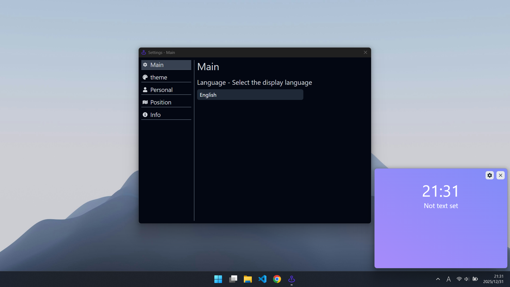

# Widget

- [日本語はこちら](./README_japanese.md)

## Table of contents
- [What is this?](#what-is-this)
- [Setup](#setup)
- [How to use](#how-to-use)

## What is this?
- This app is a simple and fast widget app made using Tauri and React technologies.

## Setup
- Run `npm install`

## How to use
- When you start of dev mode
  - Run `npm run tauri dev`

- When you build
  - Run `npm run tauri build`
