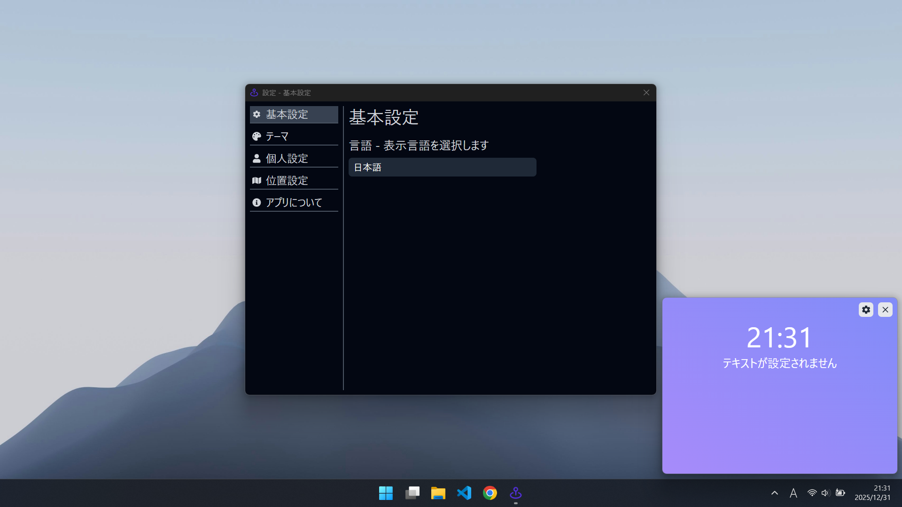

# Widget

## 目次
- [このアプリについて](#このアプリについて)
- [セットアップ](#セットアップ)
- [使い方](#使い方)

## このアプリについて
- このアプリはTauriとReactなどの技術を使用して作られたシンプルで高速なウィジェットアプリです。

## セットアップ
- `npm install`を実行してください

## 使い方
- 開発モードで立ち上げる時
  - `npm run tauri dev`を実行してください

- アプリをビルドするとき
  - `npm run tauri build`を実行してください
